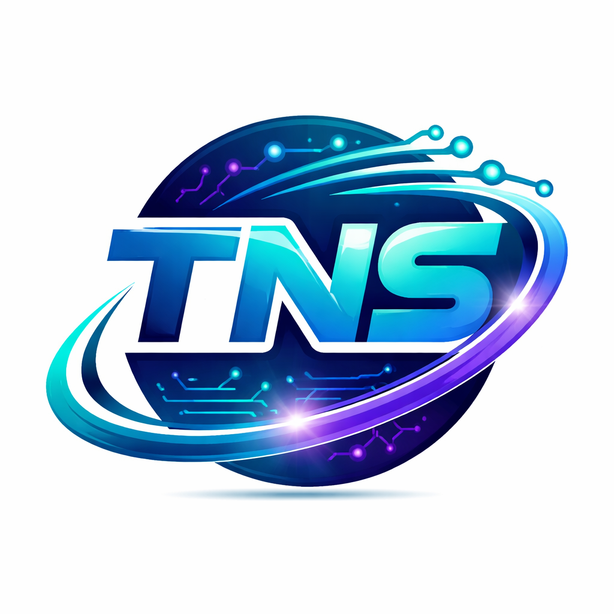

# TechNova Solutions | AI Powered ~ Smart Digital Solutions



## 🚀 Digital Intelligence Redefined
TechNova Solutions is a global leader in AI-native application architectures, high-performance web engineering, and scalable mobile ecosystems. We specialize in transforming complex business visions into elite digital products.

## 🛠️ Tech Stack
- **Frontend**: Custom HTML5, Vanilla CSS3 (Premium Glassmorphism), JavaScript (ES6+)
- **Intelligence**: Integrated AI Assistant (Nova), Neural Processing Mockups
- **Design**: Dark-Glass Premium UI/UX, Dynamic Micro-animations
- **Infrastructure**: Cloud-native architectures, Edge-ready performance

## 📦 Key Features
- **Nova AI Core**: An integrated AI assistant for real-time customer engagement.
- **Enterprise & Startup Engineering**: Tailored solutions for global MNCs and high-growth startups/freelancers.
- **Performance Optimized**: Elite engineering for sub-second load times and smooth interactions.
- **Mobile First**: Fully responsive, adaptive layouts with full-screen mobile AI integration.

## 📂 Project Structure
```bash
├── index.html        # Enterprise Landing Page
├── about.html        # Corporate Mission & Vision
├── services.html     # Specialized AI Services
├── portfolio.html    # Case Studies & Implementations
├── internship.html   # Global Career Opportunities
├── contact.html      # Proposal Gateway
├── style1.css        # Premium Dark-Glass Design System
├── script.js         # Core Intelligence & Interactivity
└── assets/           # Visual Assets & Project Documentation
```

## 🤝 Partners & Influence
TechNova operates as a decentralized powerhouse, impacting industries across multiple global sectors with unyielding innovation.

---
© 2026 TechNova Solutions. Developed with ~ Full AI Intelligence 🚀
